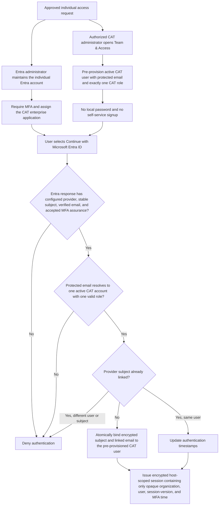

# CAT Account Lifecycle

CAT accounts are individually assigned, pre-provisioned application records bound to an organization identity-provider identity. Self-service signup and shared accounts are prohibited. This procedure defines security actions without inventing a new approval hierarchy; the organization must record its named approvers privately.

## Account provisioning and first identity binding



Entra proves the person and MFA assurance; CAT decides whether that identity has an active application account and what the person may do. Neither side alone creates usable CAT access.

## Sign-in and ongoing session authorization

```mermaid
sequenceDiagram
    actor User
    participant Browser
    participant Entra as Microsoft Entra ID
    participant CAT as CAT website
    participant DB as CAT PostgreSQL

    User->>Browser: Start organization sign-in
    Browser->>Entra: OIDC authorization with PKCE and state
    Entra-->>CAT: Stable subject, verified email, MFA assurance
    CAT->>DB: Resolve protected email, active account, one role, subject binding, session version
    alt Any identity or CAT check fails
        CAT-->>Browser: Deny; no CAT session
    else All checks pass
        CAT-->>Browser: Encrypted, Secure, HttpOnly, host-scoped session
    end

    Browser->>CAT: Later protected request with opaque session
    CAT->>DB: Revalidate organization, active user, exact role, and auth_session_version
    alt Active record and session version still match
        CAT-->>Browser: Authorized response
    else Deactivated, role invalid, or session version changed
        CAT-->>Browser: Deny and require sign-in
    end

    Note over Entra,CAT: Entra is consulted at sign-in or reauthentication. Immediate offboarding also requires CAT deactivation or session revocation, which increments auth_session_version.
```

## Lifecycle

1. **Request and approve:** record the business need, intended organization, role, approver, and expiry/review date where temporary. Verify the person has an individual IdP account with MFA.
2. **Provision:** a System Owner may assign any role. A Local Administrator may assign only lower roles and cannot manage peer administrators or the System Owner. The app creates no local password.
3. **Activate/use:** first OIDC sign-in must provide a verified email and configured MFA assurance; the user must be active and have exactly one valid role.
4. **Review:** at least quarterly, System Owner/Local Administrator reviews active accounts, administrator roles, linked identity state, last authentication, role need, and service accounts. Record the review outside this public repository.
5. **Role change:** use Team & Access. Role changes are organization-scoped, hierarchy-checked, audited, and increment `auth_session_version` to revoke existing sessions.
6. **Leave/change of duties:** immediately deactivate or reduce access when notified. Deactivation revokes all sessions. Remove the IdP assignment as a separate action.
7. **Dormancy:** there is no automated dormant-account disablement. The quarterly reviewer must investigate accounts with no authentication within the organization-defined period and deactivate when continued need is not confirmed.
8. **Reactivation:** require a new approval and confirm current identity/MFA/role. Reactivation also revokes old sessions.

## Administrators, service and emergency access

- Administrative access must use individually attributable accounts; routine CAT use should use the least privileged role.
- No CAT service account is currently required for end-user access. GitHub, Vercel, Neon, R2, scanner, and OIDC machine credentials are inventoried as provider/service identities and rotated/offboarded separately.
- Emergency access must be an individually attributable System Owner/administrator identity protected by MFA and recovery controls. A shared “break glass” login must not be created without a separate approved exception, monitored use, immediate credential rotation, and incident review.
- At least two authorized people should be able to recover provider administration without sharing a credential, subject to the organization’s ownership decision.

Evidence: `src/lib/team-access.ts`, `src/lib/production-auth.ts`, `src/lib/auth-options.ts`, migrations `0011`/`0012`+, and `tests/team-access.test.mjs` / production-auth tests.
